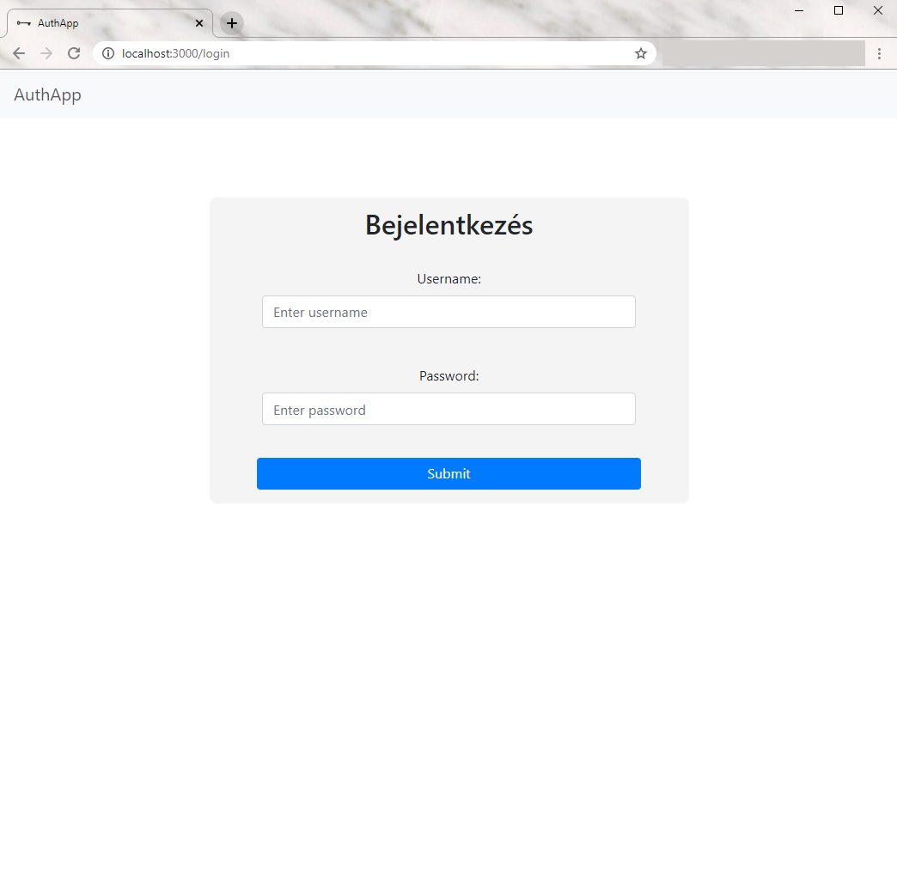
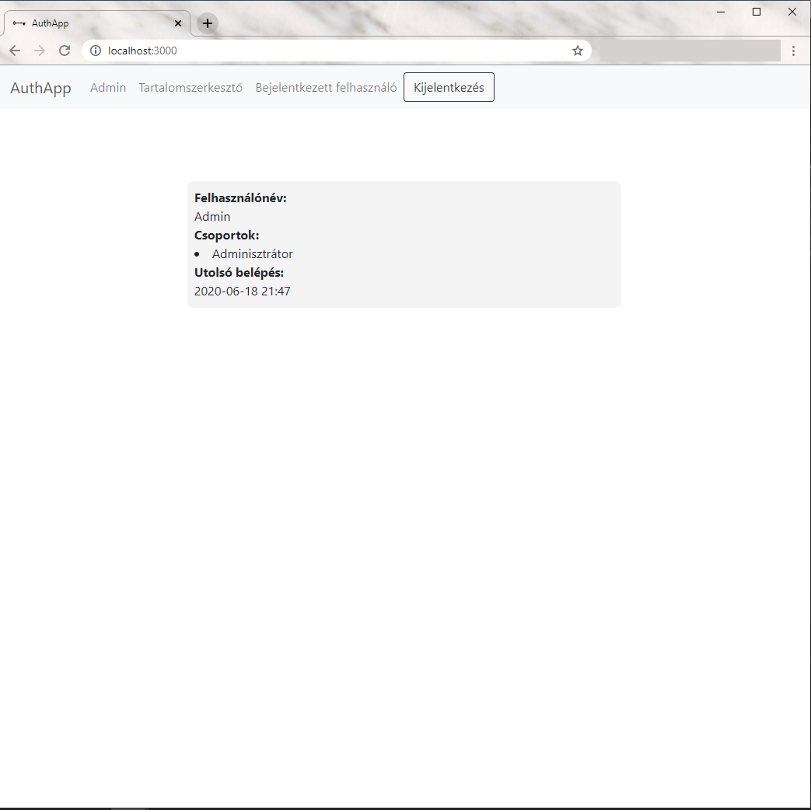

# AuthApp
### Introduction
This project was created for the second round of a job interview.
### Preview
  
## Getting Started

### Set up database and schema access
The application uses a MySQL database, that you have to set up. You can use either **MySQL Workbench**:

 1. The root password has to be: *root*
 2. Create the schema wich has to be: *auth-app*
 3. After `mvn install` (in the *Installing and running the backend* section) you have to `drop` the schema and `create` it again or just `drop` all the tables one by one 

or **Docker**:

 1. `docker run --name mysql -e MYSQL_ROOT_PASSWORD=root -d mysql:8`
 2. Wait at least 30 seconds
 3. `docker exec mysql mysql -h127.0.0.1 -uroot -proot -e "CREATE SCHEMA auth-app;"`
 4. In the path *src/main/resources* rename the *application.properties* (e.g. to *application.propertiesWORKBENCH*), then rename *application.propertiesDOCKER* to *application.properties*
 5. After `mvn install` (in the *Installing and running the backend* section) drop the schema: `docker exec mysql mysql -h127.0.0.1 -uroot -proot -e "DROP SCHEMA auth-app;"`
 6. Then create the schema agin: `docker exec mysql mysql -h127.0.0.1 -uroot -proot -e "CREATE SCHEMA auth-app;"`

### Installing and running the backend
Go to the *backend* folder, than:

```
mvn install
```

> `Drop` the schema and `create` it again or just `drop` all the tables one by one as it mentioned in *Set up database and schema access* section.

Then

```
mvn spring-boot:run
```

### Installing and running the frontend

Go to the *frontend* folder, then:
```
npm install
```

Then

```
npm start
```

### Credentials and important issues
The text you have to use is **inside** the square bracket [].
- username: [Admin] | password: [admin]
- username: [User 1] | password: [user1]
- username: [User 2] | password: [user2]
- username: [User 2] | password: [user3]

**Important issue: When you succesfully logged in you will be redirected to localhost:3000/, then you have to refresh the page to render the component again**


## Built With
* [Spring Boot](https://spring.io/projects/spring-boot) 
* [React](https://reactjs.org/) 
## Author

 **Stella Tóth-Baranyi**
